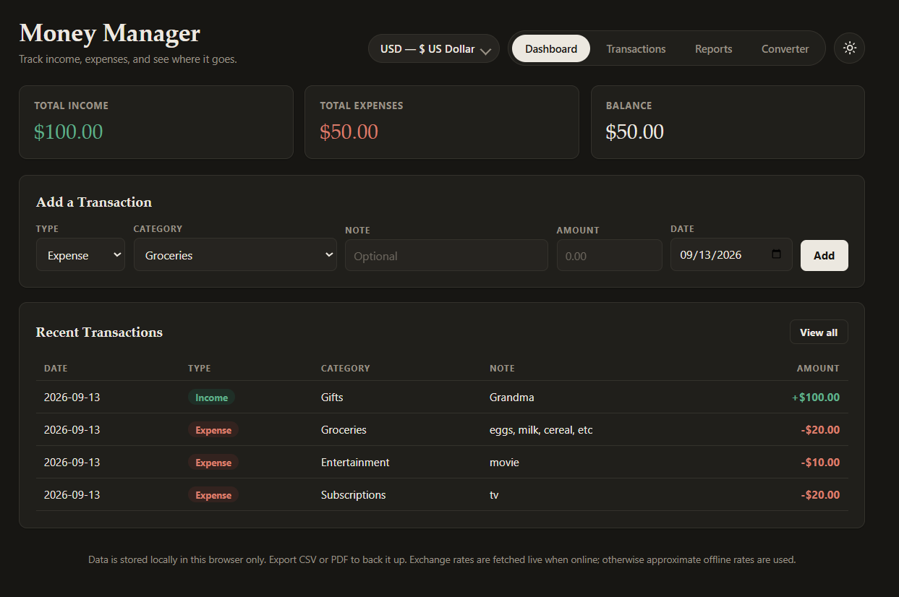

# Money Manager

A lightweight, single-file personal finance tracker you can run entirely in the browser — no build step, no backend, no dependencies to install. Track income and expenses, browse and filter your history, convert between world currencies, and generate visual and exportable reports.

**[Live Demo](https://perceus64.github.io/Money-Manager/)**

## Features

- **Dashboard** — at-a-glance totals for income, expenses, and balance, plus your most recent transactions
- **Categorized entries** — add transactions with a preset category dropdown (Groceries, Rent, Salary, etc.) that switches based on Income/Expense, or add your own custom categories on the fly
- **Transactions** — filter by type, category, or date range, and delete entries you no longer need
- **Reports** — spending and income breakdowns by category with ranked, percentage-labeled bar charts, plus a month-by-month summary
- **World currencies** — nearly 140 ISO currencies available as your app-wide display currency, with a searchable dropdown (type a code or name to filter)
- **Currency converter** — a dedicated tab to convert between any two currencies, with live exchange rates fetched online and an offline fallback when there's no connection
- **Light / dark mode** — toggle in the header, remembers your preference, and matches your system theme by default
- **CSV export** — download your (filtered) transactions as a spreadsheet-ready file
- **PDF export** — download a formatted transactions list or a full report (totals, category breakdown, monthly summary)
- **Local storage** — your data, custom categories, currency, and theme are all saved in the browser between visits; nothing is sent to a server

## Usage

- **Add a transaction** from the Dashboard tab: choose Income or Expense, pick a category from the dropdown (or select "+ Add new category…" to create your own), add an optional note, amount, and date, then click **Add**.
- **Browse or filter** everything from the Transactions tab — filter by type, category, or a date range, and delete entries you no longer need.
- **Export** — from the Transactions tab, **Export CSV** or **Export PDF** download whatever is currently filtered. From the Reports tab, **Export Report PDF** downloads a full summary for the selected period.
- **Change currency** — use the searchable currency dropdown in the header to set your display currency. Type to search by code or name (e.g. "yen", "JPY", "rupee"). This changes how amounts are displayed everywhere; it does not convert existing entries.
- **Convert currencies** — open the Converter tab, enter an amount, and pick From/To currencies (also searchable). Use the swap button to flip them, or the shortcut button to set the "To" currency as your app-wide display currency.
- **Switch themes** using the toggle in the top-right corner of the header.

## Data & Privacy

All data is stored locally in your browser via `localStorage`. Nothing is transmitted anywhere except exchange rate lookups for the converter (see below). This also means:

- Data is tied to a specific browser and device — it won't sync across devices.
- Clearing your browser data will erase your transactions, custom categories, and preferences. Export to CSV or PDF regularly if you want a backup.
- Using a private/incognito window won't persist data after you close it.

## Exchange Rates

The currency converter fetches live rates from a free, no-key-required API ([open.er-api.com](https://www.exchangerate-api.com/docs/free)) when you're online. If the request fails or you're offline, it falls back to a small set of fixed approximate rates and clearly labels the result as offline/approximate rather than live.

## Tech Stack

- Plain HTML, CSS, and JavaScript — no framework, no build tools
- [jsPDF](https://github.com/parallax/jsPDF) + [jsPDF-AutoTable](https://github.com/simonbengtsson/jsPDF-AutoTable) (loaded via CDN) for PDF generation
- [open.er-api.com](https://www.exchangerate-api.com/docs/free) (loaded via `fetch`) for live exchange rates

## Roadmap Ideas

- Budgets and spending limits per category
- Recurring transactions
- Automatic conversion of historical entries when switching currencies
- Import from CSV
- Pie/line charts in addition to bar breakdowns

## License

MIT — free to use, modify, and share.
